### Create virtual machine
1.	Click the **New** button found on the upper left-hand corner of the Azure portal.<br/>
2.	Select Compute, and then select **Ubuntu Server 16.04 LTS**.<br/>
3.	Enter the virtual machine information. For Authentication type, select **Password** and enter the Password. When complete, click **OK**.<br/>
<br/>
4.	Select a size for the VM. To see more sizes, select View all or change the Supported disk type filter.<br/>
<br/>
5.	Under Settings, keep the defaults and click **OK**.<br/>
6.	On the summary page, click Ok to start the virtual machine deployment.<br/>
7.	The VM will be pinned to the Azure portal dashboard. Once the deployment has completed, the VM summary automatically opens.<br/>

### Create ubuntu vm images 
1.	Click on the **Resource Group** icon on the Menu navigation bar.<br/>
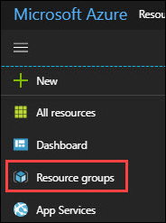<br/>
2.	From azure portal, go to virtual machine and select the **JumpVM**. In Overview section, click on **Connect** button. It will show username with IP address copy that IP address.<br/>
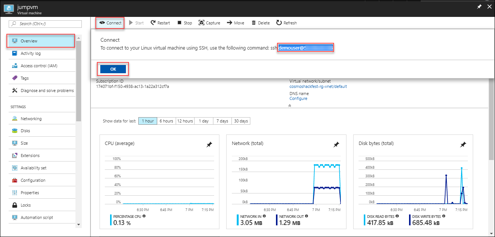<br/>
3.	Now run putty.exe from your PC.
4.	This is the application window that pops up when you run putty.exe. Paste the Username with Public IP address of the VM that you copied in step 2 to the Host Name (or IP address) box of the putty. Port will be 22 by default. Click on **Open**.<br/><br/>
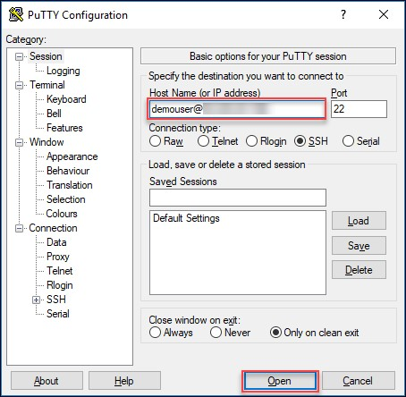<br/>
5.	The PuTTY Security Alert will pop up. Click on **Yes**.<br/>
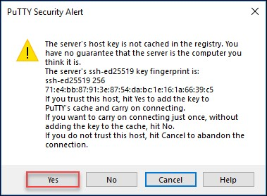<br/>
6.	Login using your password for the Virtual Machine provided while creating virtual machine.<br/>
<br/>
7.	Ubuntu ensures the authenticity of software packages by verifying that they are signed with GPG keys, so we first must import they key for the official MongoDB repository.<br/>
```
sudo apt-key adv --keyserver hkp://keyserver.ubuntu.com:80 --recv 2930ADAE8CAF5059EE73BB4B58712A2291FA4AD5
```
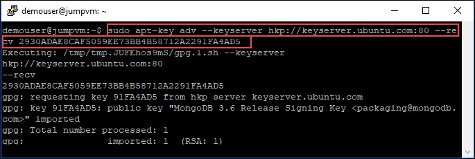<br/>
8.	Next, we have to add the MongoDB repository details so apt will know where to download the packages from.Issue the following command to create a list file for MongoDB.<br/>
```
echo "deb [ arch=amd64,arm64 ] https://repo.mongodb.org/apt/ubuntu xenial/mongodb-org/3.6 multiverse" | sudo tee /etc/apt/sources.list.d/mongodb-org-3.6.list
```
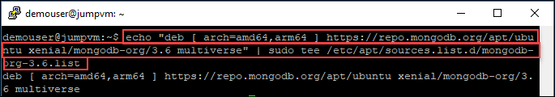<br/>
9.	After adding the repository details, we need to update the packages list.<br/>
```
sudo apt-get update
```
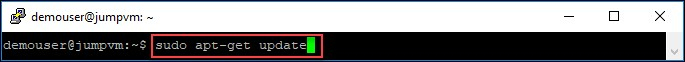<br/>
10.	Now we can install the MongoDB package itself.<br/>
```
sudo apt-get install -y mongodb-org
```
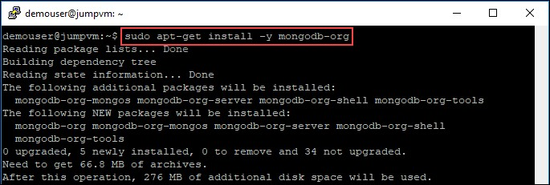<br/>
11.	 Start the mongodb Service by running the following command:<br/>
```
sudo service mongod start
```
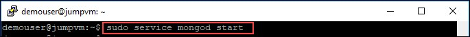<br/>
12.	 Verify the mongoDB database while running the mongo as shown below.<br/>
```
mongo
```
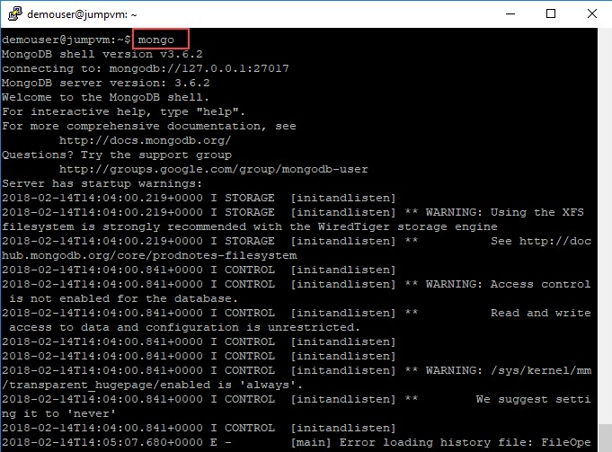<br/>
13.	You can also verify the records in mongoDB database while running the following commands.<br/>
```
shows dbs
use contosoairdb3
db.contoairdb3.insert({"test":"test"})
exit
```
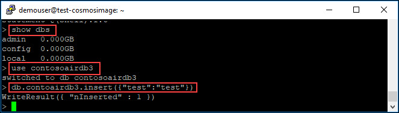<br/> 
14.	Run the command for git clone:<br/>
```
git -C /home/demouser/ clone https://github.com/SpektraSystems/CosmosDB-Hackfest.git
```
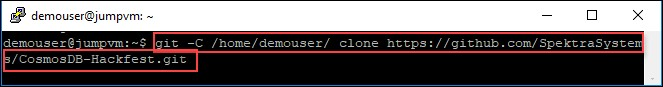<br/>
15.	Run the following command, it will update the package lists for upgrades for packages that need upgrading, as well as new packages that have just come to the repositories.<br/>
```
sudo apt-get update && sudo apt-get -y upgrade
```
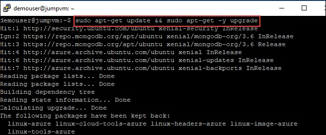<br/>
16.	Run following command for installing the Personal Package Archive. This will give you access to its contents:<br/>
```
curl -sL https://deb.nodesource.com/setup_6.x | sudo -E bash -
```
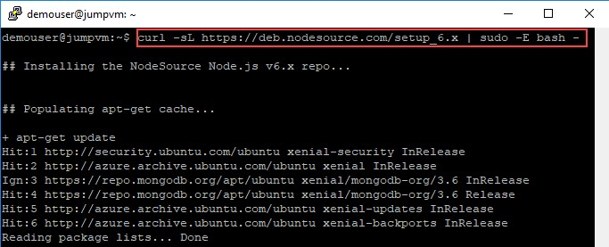<br/>
17.	Run the following command for installing Node.js:<br/>
```
sudo apt-get install -y nodejs
```
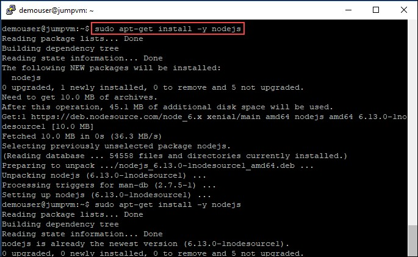<br/>
18.	Check the available Node.js versions with following command.<br/>
```
npm -v
```
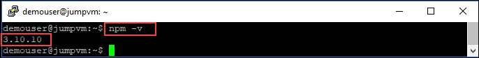<br/>
19.	After installing we need for verifying the application with given commands:<br/>
```
ls
cd CosmosDB-Hackfest/ContosoAir/src/ContosoAir.Services/
sudo npm install
npm start
```
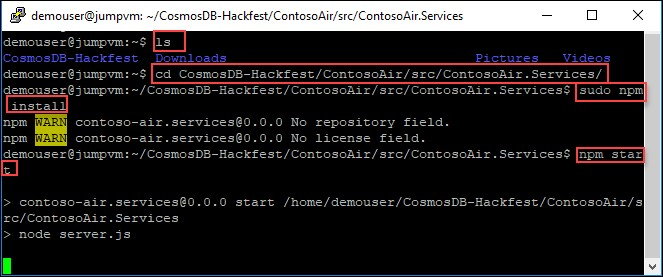<br/>
20.	To start the ContosoAir Website layer, run the below commands:<br/>
```
cd
cd CosmosDB-Hackfest/ContosoAir/src/ContosoAir.Website/
sudo npm install -g @angular/cli
```
<br/>
21.	Install repository and key with the following script:<br/>
```
cd
curl https://packages.microsoft.com/keys/microsoft.asc | gpg --dearmor > microsoft.gpg
sudo mv microsoft.gpg /etc/apt/trusted.gpg.d/microsoft.gpg
sudo sh -c 'echo "deb [arch=amd64] https://packages.microsoft.com/repos/vscode stable main" > /etc/apt/sources.list.d/vscode.list'
```
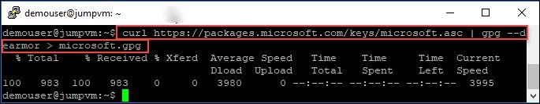<br/>
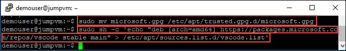<br/>
22.	Then update the package cache and install the package using following commands:<br/>
```
sudo apt update
sudo apt install code
```
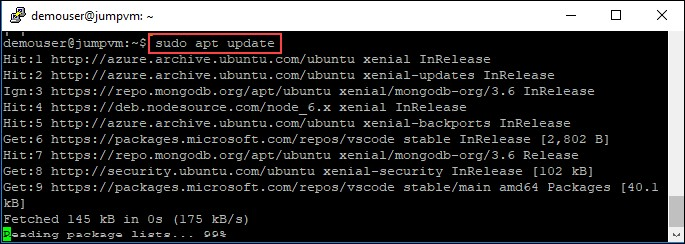<br/>
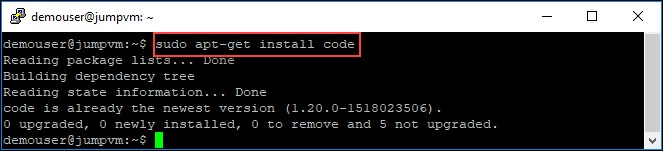<br/>
23. Run the below command for installing vscode:
```
sudo sed -i 's/BIG-REQUESTS/_IG-REQUESTS/' /usr/lib/x86_64-linux-gnu/libxcb.so.1
```
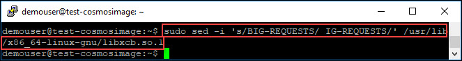<br/>
23.	Install a desktop environment on your Linux VM. Next, install xfce using apt as follows: <br/>
```
sudo apt-get update
sudo apt-get install xfce4 -y
```
<br/>
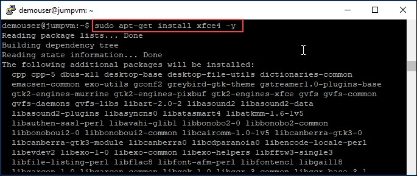<br/>
24.	Install xrdp on your Ubuntu VM as follows:<br/>
```
sudo apt-get install xrdp -y
```
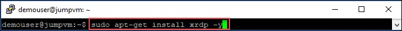<br/>
25.	Configure xrdp to use xfce as your desktop environment as follows:<br/>
```
echo xfce4-session >~/.xsession
```
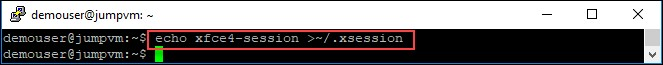<br/>
26. Restart the xrdp service for the changes to take effect as follows:<br/>
```
sudo service xrdp restart
```
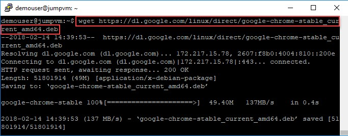<br/>
27. Go to azure portal and select **Resource Group>Virtual Machine>Networking**. Add Inbound rule under networking as shown below:<br/>
<br/>
28. Provide the following parameters for creating Inbound Rule:<br/>
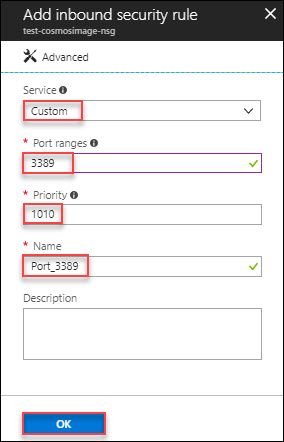<br/>
29. Go back to putty and use netstat on your Linux VM to verify that your VM is listening for RDP connections as follows:<br/>
```
sudo netstat -plnt | grep rdp
```
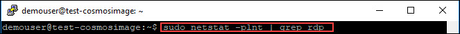<br/>
30. The following example shows the VM listening on TCP port 3389 as expected:<br/>
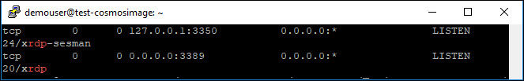<br/>
31. After adding the remote desktop details, we need to update the packages list with following command.<br/>
```
sudo apt-get -f install -y
```
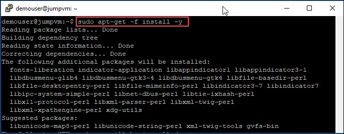<br/>

32.	Configure google chrome while running following commands one by one:<br/>
```
wget https://dl.google.com/linux/direct/google-chrome-stable_current_amd64.deb
sudo dpkg -i google-chrome-stable_current_amd64.deb
```
<br/>
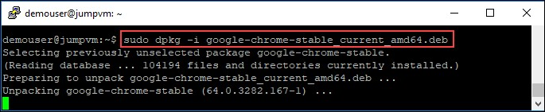<br/>

33.	Connect to your Linux VM using an SSH client. In the SSH window, type the following command:<br/>
```
sudo waagent -deprovision
```
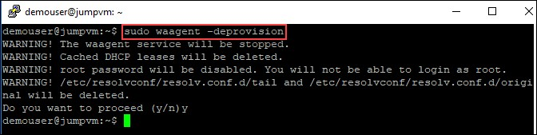<br/>
34.	From azure portal, go to virtual machine and select the JumpVM. In Overview section, click on Capture button.<br/>
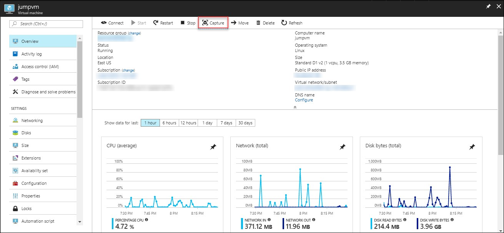<br/>
35.	 Click on Create button for creating image.<br/>
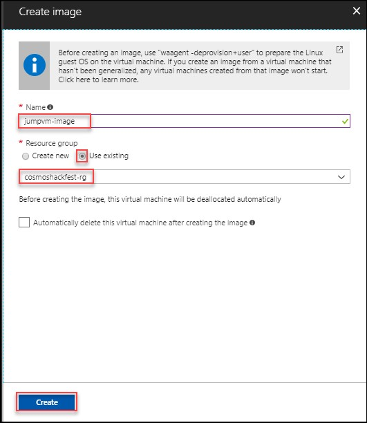<br/>
36.	 Once the image deployed click on the it and go to image.<br/>
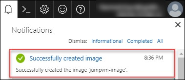<br/>
37.	Click on Create VM for deploying virtual machine with created image.<br/>
<br/>

### Connect to Virtual Machine
1. From azure portal, go to virtual machine and select the JumpVM. In Overview section, click on **Connect** button. It will show username with IP address copy that IP address.<br/>
<br/>
1. Click on start button and search for **Remote Desktop Connection** and click on it.<br/>
1. Remote Desktop Connection window will pop-up in that provide the IP Address that you copied in above step.<br/>
<br/>
1. Click on **Yes** button in Remote Desktop Connection Wizard.<br/>
<br/>
1. Enter the credentials provided in the mail to connect to VM.<br/>
<br/>

    > Note If you get err:connecting at first login: Click OK and try again.
1. Once you are logged in the Ubuntu OS click on Application for accessing visual studio code as shown blow.<br/>
<br/>
1. Go to **File** and select the **Open Folder**.
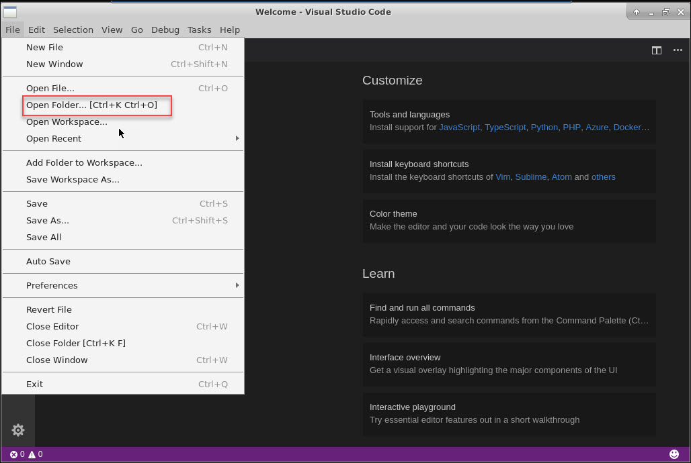<br/>
1. Select demouser and Click on CosmosDB-Hackfest.<br/>
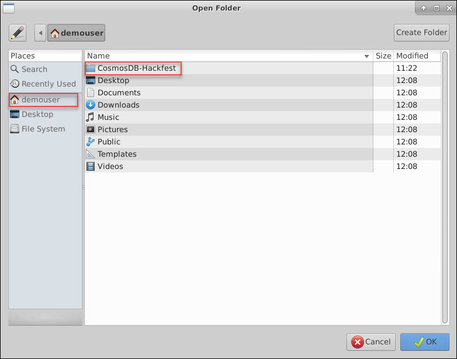<br/>
1. Now, open **scr** folder in VS code.<br/>
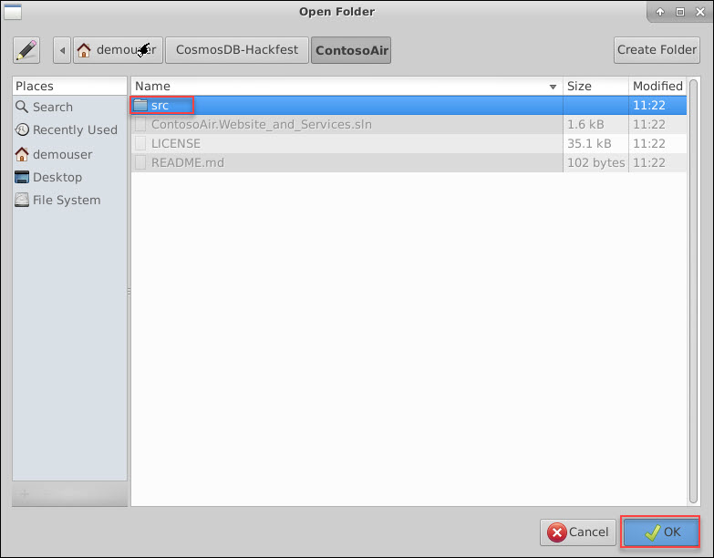<br/>
1. Notice the folders hierarchy in VS code.<br/>
.<br/>
